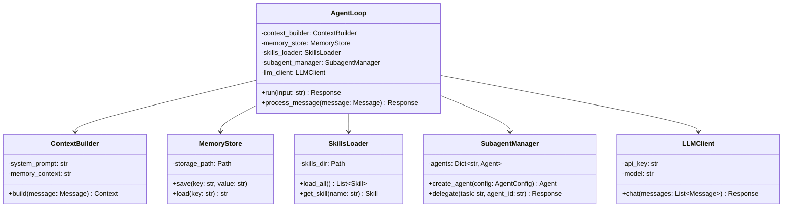
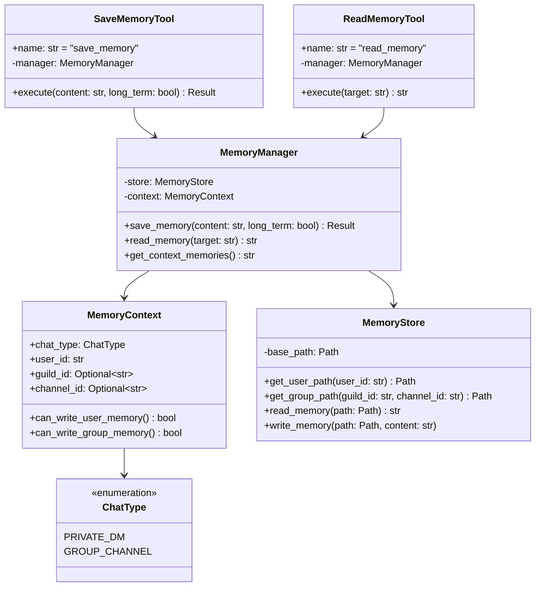
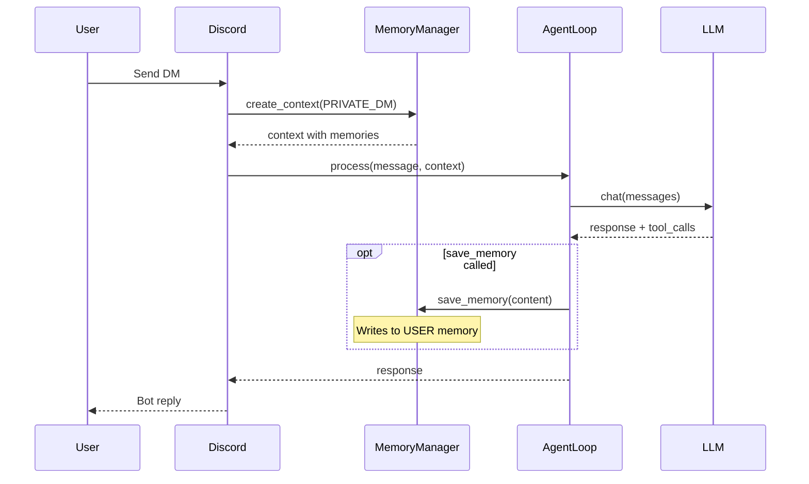
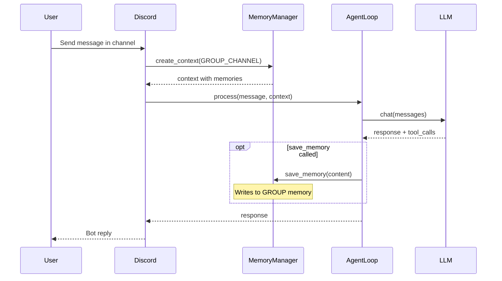
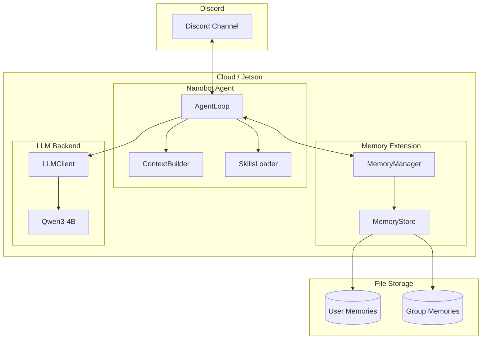
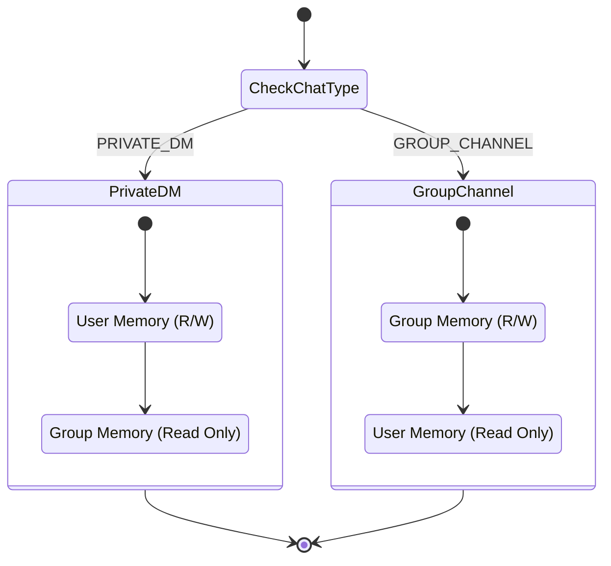

# Nanobot Multi-Scope Memory System

A contribution to [HKUDS/nanobot](https://github.com/HKUDS/nanobot) adding isolated memory management for multi-user and multi-channel scenarios.

## Problem

The current nanobot memory system uses a single workspace-level memory store, which means:
- All users share the same memory in group chats
- Personal preferences leak into shared context
- No isolation between different Discord servers/channels

## Solution

This improvement implements a **dual-layer memory system** with context-aware read/write permissions:

| Chat Type | User Memory | Group Memory |
|-----------|-------------|--------------|
| **Private DM** | Read + Write | Read only |
| **Group Chat** | Read only | Read + Write |

## Features

- **Per-user memory**: Each user has isolated personal memory
- **Per-group memory**: Each Discord server/channel has its own shared memory
- **Smart context loading**: Automatically loads relevant memories based on chat context
- **Permission-aware tools**: `save_memory` and `read_memory` tools respect context
- **Daily + Long-term storage**: Both short-term notes and permanent facts

## Directory Structure

```
workspace/
└── memory/
    ├── users/
    │   ├── user_123456789/
    │   │   ├── MEMORY.md          # Long-term personal facts
    │   │   └── 2026-02-04.md      # Daily notes
    │   └── user_987654321/
    │       └── ...
    └── groups/
        ├── group_guild123_channel456/
        │   ├── MEMORY.md          # Long-term group knowledge
        │   └── 2026-02-04.md      # Daily group notes
        └── group_guild123_channel789/
            └── ...
```

## Installation

1. Copy files to your nanobot installation:

```bash
cp -r nanobot/agent/memory_manager.py /path/to/nanobot/nanobot/agent/
cp -r nanobot/agent/tools/memory_tools.py /path/to/nanobot/nanobot/agent/tools/
cp -r nanobot/channels/discord_channel.py /path/to/nanobot/nanobot/channels/
```

2. Apply the patch to `loop.py`:

```bash
cd /path/to/nanobot
git apply patches/loop_memory.patch
```

3. Add memory instructions to your `workspace/AGENTS.md` (see `workspace/AGENTS_MEMORY.md`)

## Usage

### For Users

The agent automatically:
- Remembers personal preferences in DMs
- Maintains shared context in group channels
- References your personal context when you chat in groups

### For the Agent

New tools available:

```python
# Save to appropriate memory (respects chat context)
save_memory(content="User prefers dark mode", long_term=True)

# Read specific memories
read_memory(target="self")   # Current user's memory
read_memory(target="group")  # Current group's memory
read_memory(target="user", user_id="123")  # Specific user (in groups)
```

## Configuration

Add to your `config.json`:

```json
{
  "memory": {
    "user_retention_days": 30,
    "group_retention_days": 90,
    "max_context_tokens": 2000
  }
}
```

## API Reference

### MemoryManager

```python
from nanobot.agent.memory_manager import MemoryManager, MemoryContext, ChatType

manager = MemoryManager(workspace_path)

# Build context for a chat
ctx = MemoryContext(
    user_id="123456789",
    group_id="guild_channel",
    chat_type=ChatType.GROUP
)

# Get combined memory for LLM context
memory_text = manager.get_context_for_chat(ctx)

# Save with permissions
manager.save_memory(ctx, "Important fact", long_term=True)
```

### ChatType

- `ChatType.PRIVATE` - Direct messages
- `ChatType.GROUP` - Server/channel messages

## Architecture

For detailed UML diagrams, see [docs/nanobot-uml.md](docs/nanobot-uml.md).

### Class Diagram - Core Architecture



### Class Diagram - Memory Extension



### Sequence Diagram - Private DM Flow



### Sequence Diagram - Group Channel Flow



### Component Diagram - Full System



### State Diagram - Memory Permissions



## License

MIT - Same as nanobot
