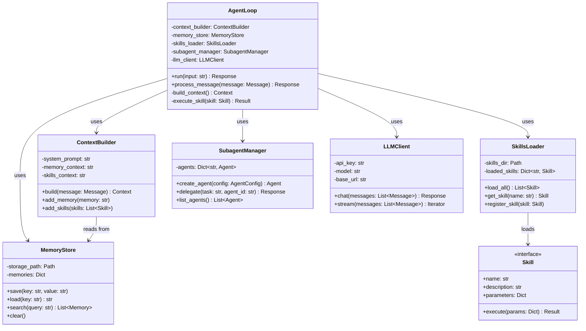
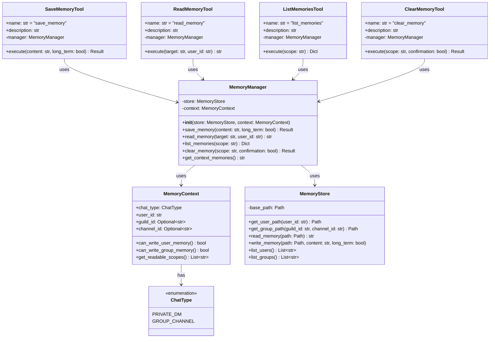
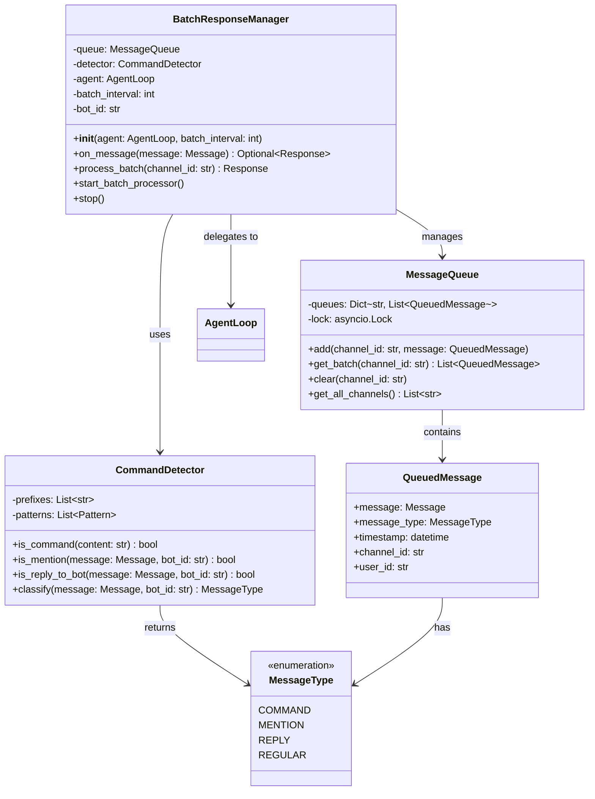
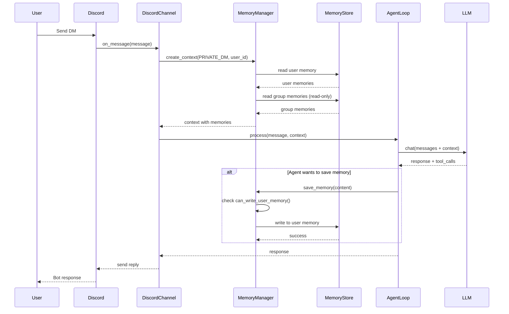
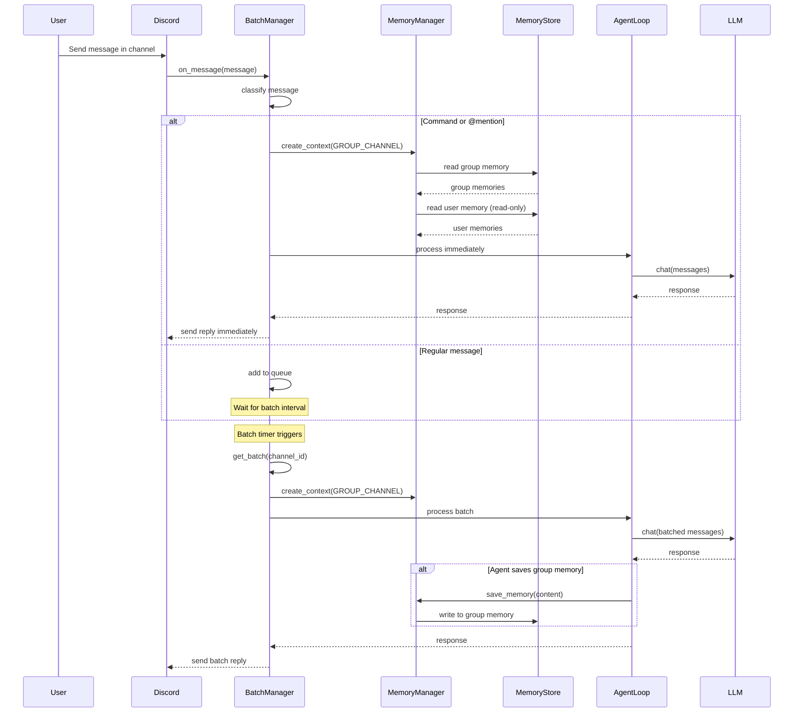
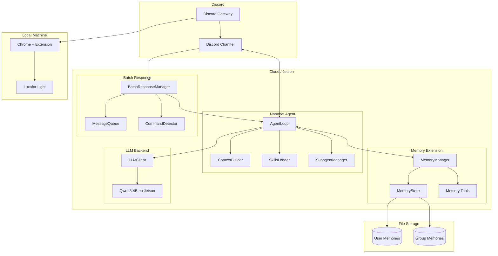
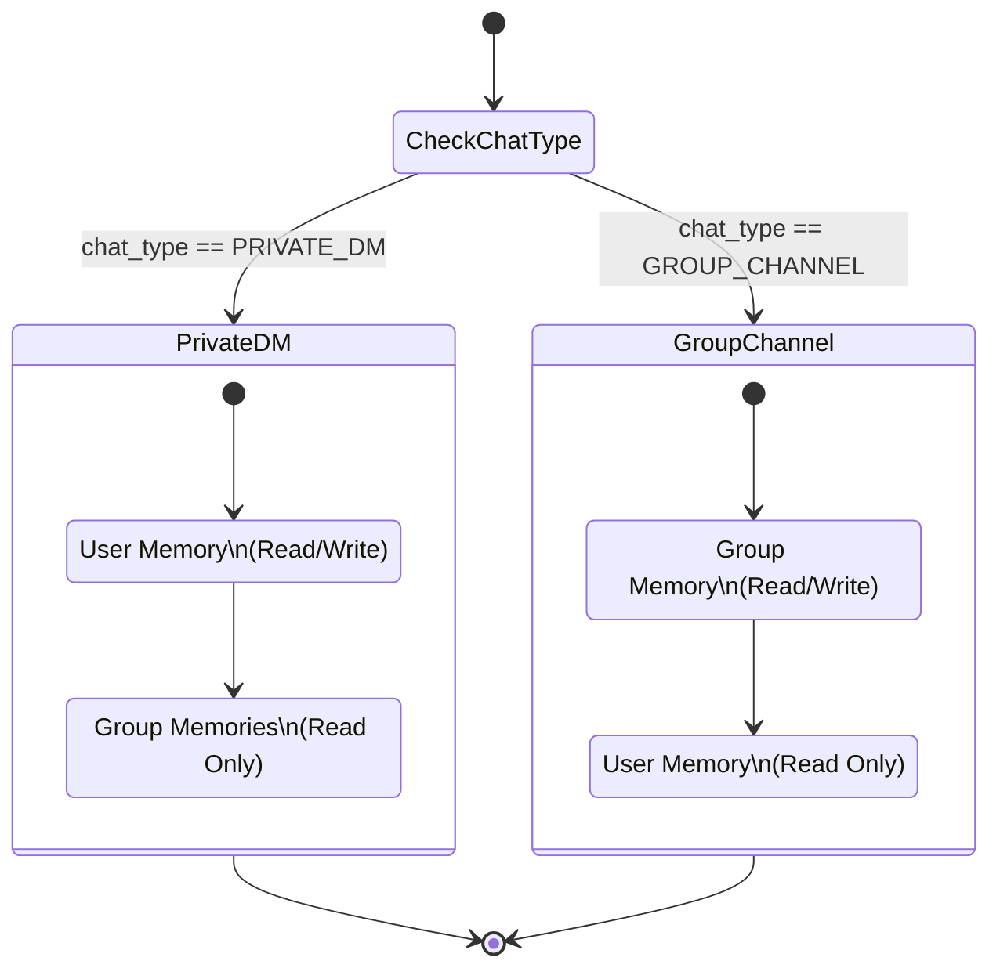

# Nanobot Architecture UML

## Class Diagram - Core Architecture



## Class Diagram - Memory Improvement Extension



## Class Diagram - Batch Response System



## Sequence Diagram - Private DM Flow



## Sequence Diagram - Group Channel Flow



## Component Diagram - Full System



## State Diagram - Memory Permissions



## File Structure

```
nanobot/
├── agent/
│   ├── __init__.py
│   ├── loop.py              # AgentLoop
│   ├── context.py           # ContextBuilder
│   ├── memory.py            # Original MemoryStore
│   ├── skills.py            # SkillsLoader
│   ├── subagents.py         # SubagentManager
│   └── llm.py               # LLMClient
│
├── channels/
│   ├── __init__.py
│   ├── base.py              # Base channel interface
│   ├── discord.py           # Discord integration
│   └── cli.py               # CLI interface
│
└── skills/
    ├── __init__.py
    ├── web_search.py
    ├── code_execute.py
    └── ...

nanobot-memory-improvement/
├── nanobot/
│   └── agent/
│       ├── memory_manager.py    # MemoryManager, MemoryStore, MemoryContext
│       ├── batch_responder.py   # BatchResponseManager
│       └── tools/
│           └── memory_tools.py  # Save/Read/List/Clear tools
│
├── workspace/
│   ├── AGENTS_MEMORY.md         # Agent instructions
│   └── memory/
│       ├── users/
│       │   └── user_{id}/
│       │       ├── MEMORY.md
│       │       └── {date}.md
│       └── groups/
│           └── group_{guild}_{channel}/
│               ├── MEMORY.md
│               └── {date}.md
│
├── patches/
│   ├── loop_memory.patch
│   └── context_memory.patch
│
└── tests/
    └── test_memory_manager.py
```
